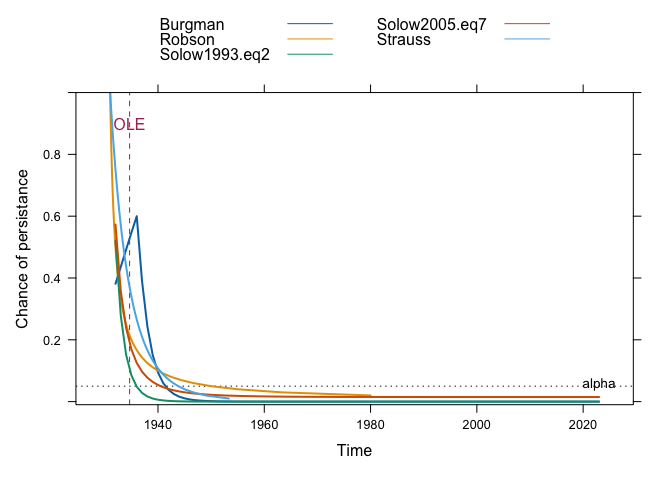

<!-- README.md is generated from README.Rmd. Please edit that file -->

# sExtinct

This package provides functions to infer the extinction status of
species based on the distribution of historic sightings (and/or
abundances). This combines several sighting based estimators of
historical extinction, allowing them to be run simultaneously or
individually. Code for this package was contributed by Ben Collen, Gene
Hunt and Tracy Rout. Additional code was taken from McPherson & Myers
(2009).

## Installing the package

``` r
## install and load devtools
install.packages("devtools")
library(devtools)

##install and load sExtinct from github
install_github("ExperimentalConservation/sExtinct")
library(sExtinct)
```

## Example analysis

Example data are provided within the package:

``` r
## load in the example data set
data("example.data")

##series of sightings 
print(example.data)
#>   years sightings
#> 1  1907         1
#> 2  1910         1
#> 3  1915         3
#> 4  1916         4
#> 5  1920         3
#> 6  1925         1
#> 7  1930         2
#> 8  1931         1
```

`Run.all` runs all of the included sightings based indicators
simultaneously. Used must specify values for `alpha` (1-alpha confidence
interval), `test.year` (typically set to the current year, i.e. test
whether the species is currently predicted to be extant or extinct),
whether to return the data, and whether the plot the results:

``` r
run.all(example.data,
        alpha = 0.05,
        test.year = 2023,
        data.out = F,
        plot = T)
#> [[1]]
```



    #> 
    #> [[2]]
    #>            Test Estimate
    #> 1           OLE     1935
    #> 2       Strauss     1944
    #> 3 Solow1993.eq2     1936
    #> 4 Solow2005.eq7     1941
    #> 5        Robson     1950
    #> 6       Burgman     1943

# References

[Clements, C., Collen, B., Blackburn, T., Petchey, O. Historic
environmental change may affect our ability to infer extinction status.
Conservation Biology, 28:
971–981.](https://conbio.onlinelibrary.wiley.com/doi/abs/10.1111/cobi.12329)

# Contact

Chis Clements - <c.clements@bristol.ac.uk>
